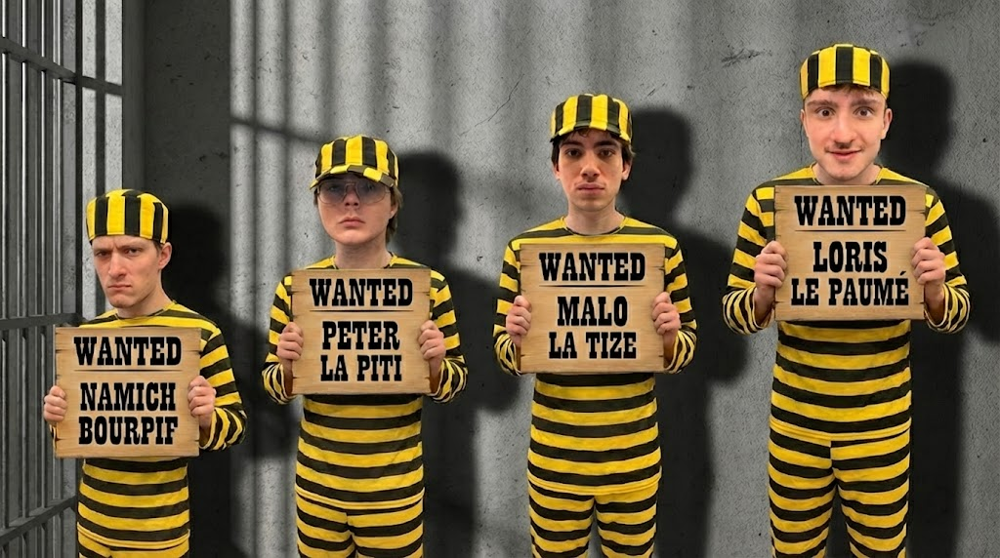

## We Plaid Guilty
### aka. ft_transcendance

<br>
<br>

*This project has been created as part of the 42 curriculum by &lt;mforest-&gt;, &lt;pmilner-&gt;, &lt;lviravon&gt; &amp; &lt;namichel&gt;*
<br>

## The Crew
### Joe,Jack,William & Averell

- **namichel** — DevOps  
  Network Architecture, Docker Config, CI/CD, WebSockets Management.
- **pmilner-** — Backend  
  Game Logic (Go), Database Management, REST API.
- **lviravon** — Backend  
  Authentication (Go), User Management, REST API.
- **mforest-** — Frontend  
  User Interface (React), Drawing Canvas, UX, API Integration.

<p align="center">
  
</p>

## Run the project

```
cd ft_transcendance
npm install
npm run dev
```
