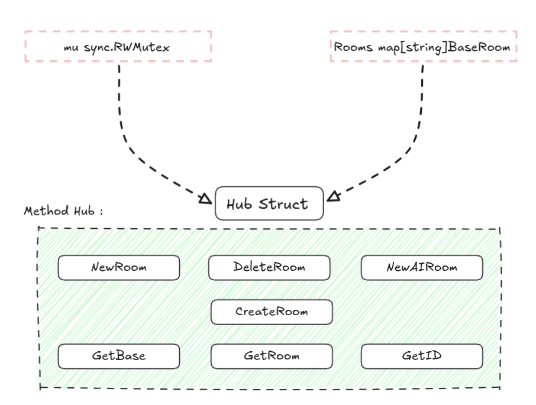
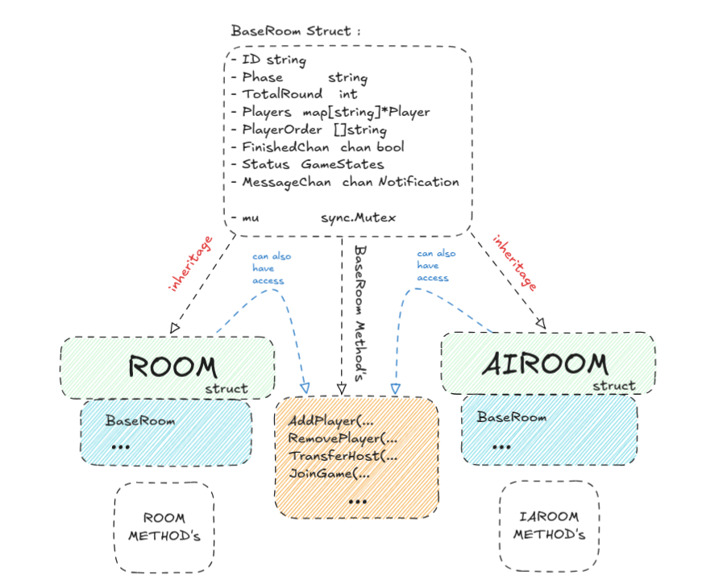
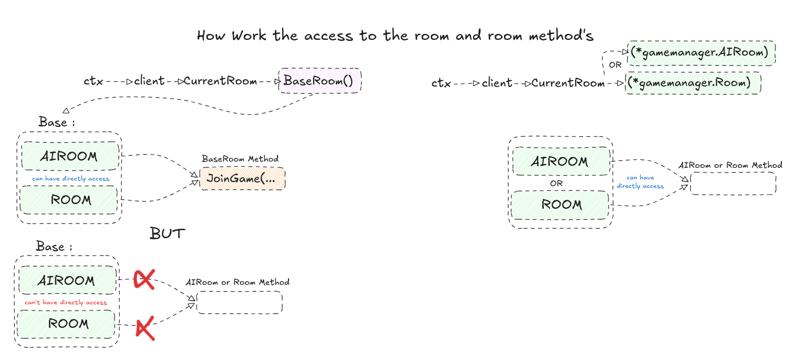
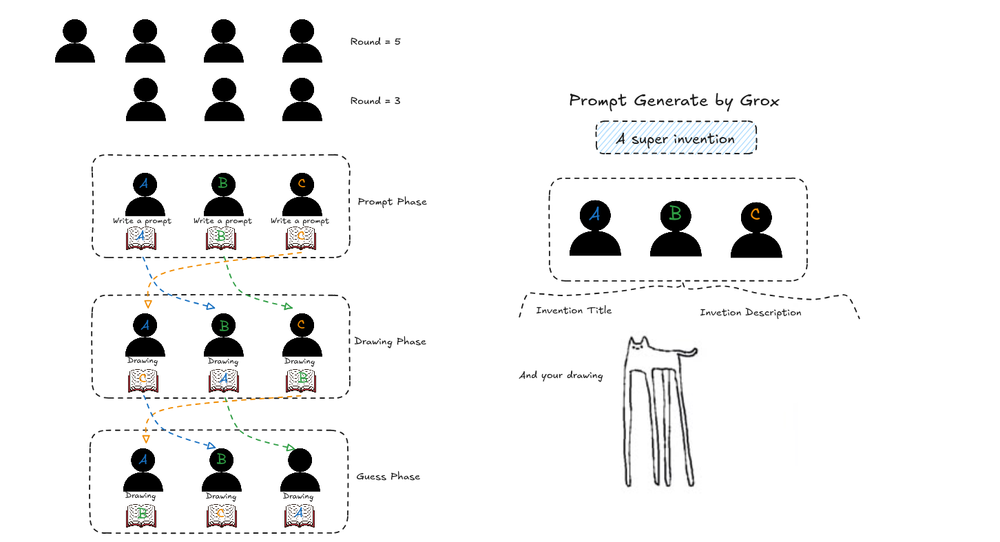
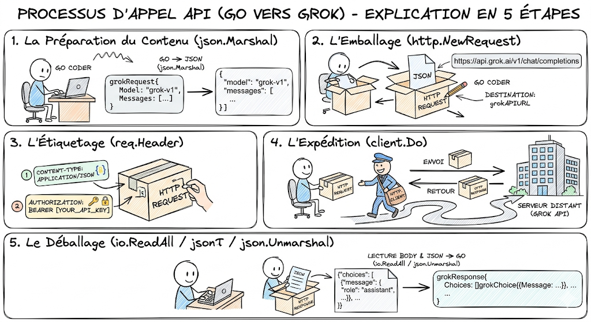

# Backend package gamemanager

## HUB struct

To start off, we have the Hub, which is strictly used for the delete room and create room calls. It will generate a BaseRoom with a boolean to check if it is an AIRoom or not.

  

## Inheritage BaseRoom

The base structure for the 2 rooms is BaseRoom. There is no true inheritance strictly speaking in Go; instead, we call this struct embedding. This means that my 2 structs, Room and IARoom, share the same common base, which gives them access to the BaseRoom methods and its public variables (public begins with an uppercase character and private with a lowercase one).

  

  

## Room struct

For a classic room, the game rules are simple: we calculate the total number of rounds based on the player count. So for 3 players, we play 3 rounds: prompt, draw, and guess. For 4 players, we do 5. As you understand, for a great Gartic Phone game, the final round must always end on a guess.

To prevent matches from feeling repetitive, we perform a quick shuffle of the players right before they enter the game. Then, we handle the distribution using swaps: each player will pass their drawing to the next one, and the last passes to the first. Thanks to this, every match feels unique because you never receive a drawing from the same person if you play many games with the same group.

  

Some use cases recommend the "crypto/rand" library over "math/rand". Why? "crypto/rand" is highly secure (it uses the OS's unpredictable cryptographic generator). "math/rand" isn't secure, but remains useful (it is much faster for non-sensitive tasks like games).

We operate with timers. A timeout means the frontend sent no messages. Normally, it never times out because the frontend intentionally sends a message right before. This saves unfinished drawings so players don't submit blanks.

## AIRoom struct

IARoom works differently. First, we use the Grok API, the only AI capable of generating funny messages without real limits besides the ones we set.

Here is how the Grok call works in Go:

  

The game mode is also different. There are no rounds, only a prompt assigned by the AI. You use your mouse and keyboard to draw, name, and describe your creation.

Once the timer ends, we move to the presentation of your works on the voting page to choose the best invention.

This time, there is no timer. How is it done? In Go, we use channels. There are different types: unbuffered and buffered. Unbuffered channels can only hold one value and block until it is received, while buffered channels can store $n$ values. Consequently, we use a goroutine to block the reception of an action—specifically the end of the round—allowing us to skip a backend timer. I chose to keep both implementations because I learned on the fly, and it showcases two different ways to proceed.

