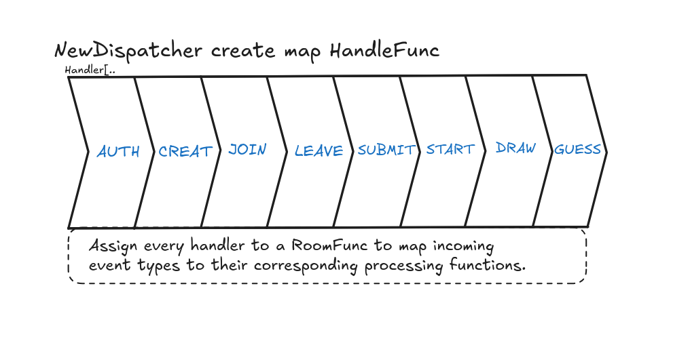
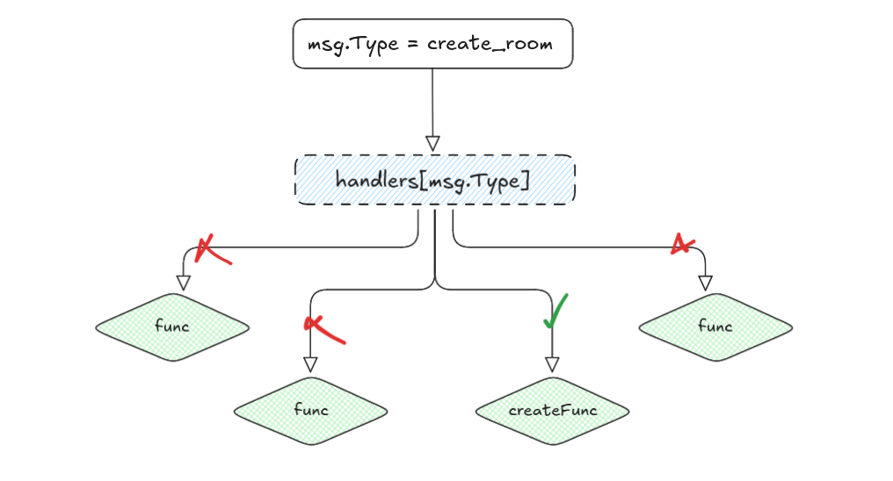
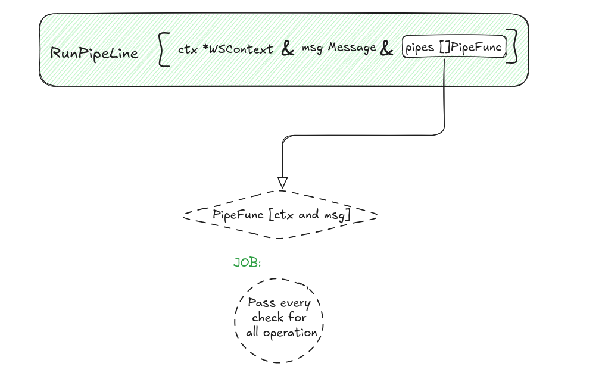

# Backend handler

## Dispatcher

The dispatcher is the heart of the communication. It acts as a bridge between the JSON messages sent by the front end and the various available handlers.

Initialization (NewDispatcher): Upon creation, the dispatcher registers all available routes (e.g., authenticate, create_room, join_game). Each key corresponds to a WebSocket message type.

  

Routing Logic (Dispatch): When a message arrives, the dispatcher checks if a handler exists for that type. If so, it executes it by passing the context (WSContext) and the message data.

  

## Pipeline struct

To ensure security and action validity, we use a Pipeline system.

Principle: Before executing a handler's logic (e.g., drawing or voting), the message passes through a series of verification functions (PipeFunc).

Validation: The RunPipeLine function executes pipes sequentially. If a single check fails (e.g., the user is not authenticated or the room does not exist), the action is immediately aborted. This keeps handlers clean and focused on their main task.

  

## Advantage 

The main advantage of these functions is that they filter received messages and assign them to the correct function through strict pipeline verification.

Perfect for maintenance or adding code: you only need to create a new function and register it.

Code readability: the code is clear and precise. All functions have a cognitive complexity of less than 15 points according to Sonarqube; the human brain struggles with functions exceeding a cognitive complexity of 15.

### Reminber :

                 for or if               | + 1
             for or if in if             | + 2
    for/if inside for/if inside for\if   | + 3
